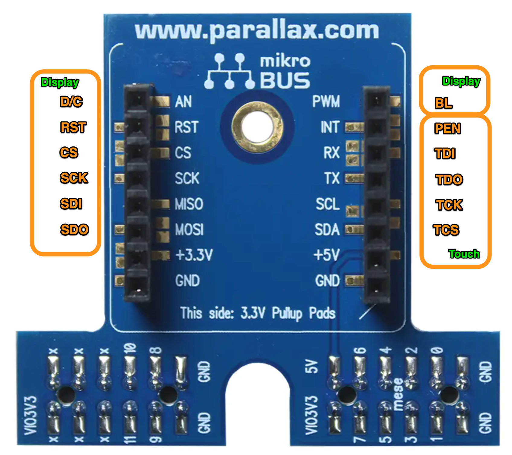

# Connecting the 3.5" ILI9488 TFT Module w/resistive touch to our P2

![Project Maintenance][maintenance-shield]

[![License][license-shield]](LICENSE)

## The 3.5" ILI9488 TFT with resistive touch (320x480 pixels) 

If you wish to use...

   
  <caption><B>TFT Display w/Touch</B></caption>

## Table of Contents

On this Page:

- [The eInk Display](#features)
- [Wiring the Display](#how-to-contribute)

Additional pages:

- [Driver Public Interface](./isp_eInk_click.txt) - shows full driver annotated API 
- [Start your project using this object](DEVELOP.md) - Walks thru configuration and setup of your own project using this object
- [Configure Display Orientation](../Docs/Orientation.md) - set driver to match your hardare set up
- [Create bitmaps for display on your eInk device](./C-src)
- [See images of all supported displays working!](./Docs) There are a small number of .PDFs in the [Docs](../Docs) directory providing  detailed information on the display and controller chips

## Connecting the TN9488 w/Touch to the P2

When using the TN9488 w/Touch, you wire the pins directly to the P2 Eval Click Adapter.  This allows us to route the touch signals to the same adapter board so the entire display with touch consumes just the P2 Eval. Header pair.

### Here's the Module pinout:

   
  <caption><B>TFT Module signal names</B></caption>

### Here's how we map to the click adapter:

   
  <caption><B>Mapping Module signal names to click adapter</B></caption>

### The Author's click adapter display wiring:

   
  <caption><B>Connections for Display SPI</B></caption>

### The Author's click adapter touch wiring:

   
  <caption><B>Connections for Touch SPI +BackLight</B></caption>

**NOTE:** we connect our **TFT-display** to the SPI-signals-side of the adapter and then connect **Touch** to the I2C-signals-side of the adapter.

### Detailed list of the connections:

| Signal Name  (J2) |  Author's Wire Color | Adapter Pin | Author's LA Pin | Author's P2 Pin
| --- | --- | --- | --- | --- 
| | ** **Display Signals**  ** | 
| VDD |  Red | +3.3v  | 
| GND |  Black | GND  | 
| CS |  Blue | CS | 2 | 40
| RST |  Violet | RST  | 1 | 39
| D/C |  Gray | AN | 0 | 38
| SDI |  Yellow | MISO | 4 | 42
| SCK |  Green | SCK | 3 | 41
| BL | Brown | PWM* | 6 | 37
| SDO |  Orange | MOSI | 5 | 43
| | ** **Touch Signals** ** | 
| TCK |  Blue | SCL | 10 | 33
| TCS |  Violet | SDA  | 11 | 32
| TDI |  Yellow | RX | 8 | 35
| TDO |  Green | TX  | 9 | 34
| PEN (INT) |  Orange | INT  | 7 | 36

**NOTE:** A single signal **BL** (backlight) is routed to the other size of the click I/F adapter board to **PWM**.  This is the side where we use the Serial and I2C pins for the Touch SPI interface.

---

> If you like my work and/or this has helped you in some way then feel free to help me out for a couple of :coffee:'s or :pizza: slices!
>
>  &nbsp;&nbsp; -OR- &nbsp;&nbsp; [Patreon.com/IronSheep](https://www.patreon.com/IronSheep?fan_landing=true)

---

## Disclaimer and Legal

> *Parallax, Propeller Spin, and the Parallax and Propeller Hat logos* are trademarks of Parallax Inc., dba Parallax Semiconductor
>
> This project is a community project not for commercial use.
>
> This project is in no way affiliated with, authorized, maintained, sponsored or endorsed by *Parallax Inc., dba Parallax Semiconductor* or any of its affiliates or subsidiaries.

---

## License

Licensed under the MIT License.

Follow these links for more information:

### [Copyright](copyright) | [License](LICENSE)

[maintenance-shield]: https://img.shields.io/badge/maintainer-stephen%40ironsheep%2ebiz-blue.svg?style=for-the-badge

[license-shield]: https://img.shields.io/badge/License-MIT-yellow.svg

